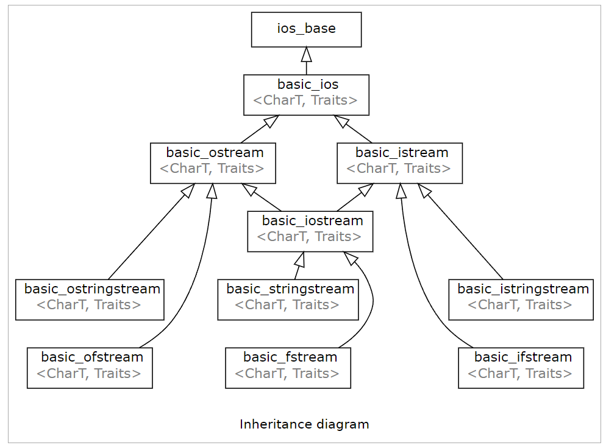

# 1. 初识输入输出
## 1.1 iostream 库
- 两个基础类型: istream, ostream
- cin, cout: 标准输入输出流对象
- cerr, clog: 为标准错误流和标准日志流对象



## 1.2 流与流对象
- 流定义: 随着时间推移,字符被生成或消耗的字符序列
- 流对象的三个状态位:
  - eofbit: 是否读到结尾
  - failbit: 是否发生可恢复错误, 如读错格式
  - badbit: 是否发生不可恢复的错误
- 流对象的判断函数:

| failbit | badbit | eofbit | good() | fail() | bad() | eof() | bool |
|---------|--------|--------|--------|--------|-------|-------|------|
| X       | X      | X      | O      | X      | X     | X     | O    |
| X       | X      | O      | X      | X      | X     | O     | O    |
| X       | O      | X      | X      | O      | O     | X     | X    |
| O       | X      | X      | X      | O      | X     | X     | X    |
| O       | O      | X      | X      | O      | O     | X     | X    |
| X       | O      | O      | X      | O      | O     | O     | X    |
| O       | X      | O      | X      | O      | X     | O     | X    |
| O       | O      | O      | X      | O      | O     | O     | X    |

```c++
// 流对象用于循环判断中需要记住一下几点
while (std::cin) {
  ...
}

// 1. 直接使用 流对象作为判断条件
//    bool() 等价为 good() || eof()
//    单独使用 good(), fail(), bad(), eof() 都是错误用法
// 2. 举例: while (cin.eof()) { ... } 会忽略最后一次合法输入
// 3. 作为循环判断时, 状态位的变化情况见 stream_test.cc
//    调用 bool 运算符, 执行了3次
//    第二次已经检测到文件结尾, 但是 bool 运算 仍然为 true, 直到读错格式为止
```

# 2. 缓冲区与流关联
- 缓冲区: 协调 IO 设备与 CPU 速度不匹配问题, 减少 IO 读写次数, 一般对程序透明, 在调试过程中需要注意时刻刷新缓冲区
- linux 下的缓冲区类型:
  - 全缓冲: 写满限制大小才刷新输入输出, 比如 一般的文件操作
  - 行缓冲: 遇到换行符后才刷新输入输出, 比如 指代终端设备的流(cin, cout)
  - 不缓冲: 没有缓冲, 一直刷新输入输出, 比如 cerr
- 关联: 一般将输入流主动与输出流相关联, 对输入流操作时会先刷新相关联的输出流的缓冲区, 一般一个流只关联一个流

| 流对象    | 是否缓冲 | 其他信息                                         |
|--------|------|----------------------------------------------|
| cin    | 行缓冲  | 用于终端输入, 跳过空白符, 遇到空白符为止(空白符留在缓冲区中), 与 cout 关联 |
| cout   | 行缓冲  | 用于终端输出, 输出需要手动刷重新                            |
| cerr   | 不缓冲  | 用于打印错误信息, 与 cout 关联                          |
| clog   | 全缓冲  | 用于打印一般性信息, 不关联任何流                            |
| stdin  | 行缓冲  | 与 cin 关联                                     |
| stdout | 行缓冲  | 与 cout 关联                                    |
| stderr | 不缓冲  | 与 cerr 关联                                    |

```c++
// 1. C++ 中空白符(space)如下, 而另一种空白符 blank 为 SPC, TAB
// ' '  SPaCe          空格
// '\t' TABle          制表符
// '\n' LineFeed       换行符
// '\r' CarriageReturn 回车符
// '\v' VerticalTable  垂直制表符
// '\f' FormFeed       换页符

// 2. 用 cin 输入时, 如果发生 variable oriented 转换为 line oriented 会产生缓冲区遗留问题:
int a; char c_array[10] = {};
cin >> a;                 // 残留 \n 空白符在缓冲区
std::cout << a << "\n";
cin.getline(c_array, 9);  // 导致 用户未预料 的行为
std::cout << c_array << "\n";

// 上述问题原因:
// std::cin 读入时虽然会忽略前导空白符, 但是会将空白符遗留在缓冲区中, 产生问题
// 有三种解决方法:
cin.getline(c_array, 9);  // (1) 明确再次使用 getline 吸收空白行
cin >> ws;                // (2) ws(cin) 吞掉前导空白符 WhiteSpace
cin.ignore(               // (3) 忽略字符 直到遇到 '\n', 包括 '\n' 也忽略在内
  std::numeric_limits<streamsize>::max(), '\n'
);
```

# 3. 命名空间
- 命名空间: 将库中的名字放在单一位置, 解决名字冲突问题, 比如标准库命名空间 std, 一般头文件不包含using声明, 防止命名冲突
- using声明: `using namespace::name;` 一次引进一个命名空间的成员, 作用域从声明开始到结束, 此时外层同名实体被隐藏
- 库名字改动: C 语言头文件`xxx.h`变为`cxxx`,让`cxxx`中的名字从属于相关的命名空间

# 4. 其他
- 结束输入符(EOF): `^ + Z + Enter`(Win), `^ + D`(Unix)
- 流重定向: `$ exename < infile > outfile`
- 注释: 单行注释(`//`) 和多行注释(`/* */`)  对于多行注释不能嵌套
- 加速标准流
```c++
// 关闭 C++ 标准流与 C 标准流同步加快速度 (之后不能混用)
std::ios::sync_with_stdio(false);
std::cin.tie(nullptr);
std::cout.tie(nullptr);
````