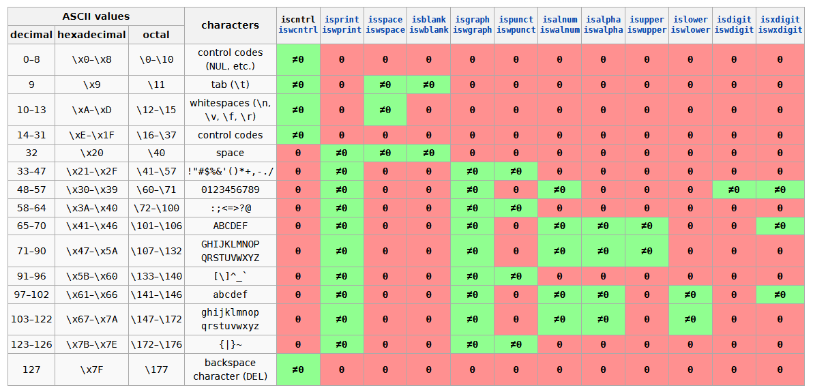

# 1. using声明
- using 声明: using namespace::name; 简化使用命名空间中的成员
- 一般不在头文件中使用 using 声明, 防止命名冲突

# 2. string
## 2.1 string 基本用法
```c++
#include <string>

// 初始化方式, 注意 string 初始化不会包含字面值常量的 '\0'
std::string s1;                           // 默认初始化
std::string s2("123");                    // 直接初始化
std::string s3(2, 'c');                   // 直接初始化为 "cc"
std::string s4(s2);                       // 拷贝初始化
                                          
// 操作方式
std::cin  >> s1;                          // 从流读入 s1, 忽略开头空白符, 遇到空白符停止(不包含空白符)
std::cout << s2;                          // 写 s2 入流
                                          
assert(!s1.empty() && s1.size() > 1);     // 返回是否为空, 返回字符个数
                                          
s1[0] = 'x';                              // 下标返回引用
s1 = s2 + s3;                             // 连接两个字符串, 返回新对象, 赋予 s1
auto a = "123"+"234";                     // error, 不能将两个字面值常量直接相加, 其中必须有一个是 string
assert(s1 != s2 || s3 < s4);              // 判断是否相同 或 按字典序再按个数比较

// 自定义类型
std::string::size_type size = s1.size();  // 字符个数大小, unsigned
```

## 2.2 geline 函数
```c++
auto &is = std::getline(std::cin, s1);        // 读入一行包括 '\n', 舍去 '\n' 后赋予 s1 内容, 返回 is
auto &is = std::getline(std::cin, s1, '\t');  // 读入一行包括 '\t', 舍去 '\t' 后赋予 s1 内容, 返回 is

auto &is = cin.getline(pstr, 30);             // 同上, 赋予 pstr 指向的字符数组, 最大字符个数为 30
auto &is = cin.getline(pstr, 30, '\n');       // 同上, 赋予 pstr 指向的字符数组, 最大字符个数为 30, 间隔字符为 '\n'
```

## 2.3 判断字符函数



## 2.4 遍历字符与转换字符
```c++
#include <cctype>
#include <string>

// for-range 遍历
for (auto &it: str) {  // 遍历每个元素 
  if (islower(it)) {
    it = toupper(it);  // 转化为大写
  }
}
  
// 下标遍历
for (decltype(str.size()) index = 0; 
     index != str.size(); ++index) {
  str[index] = tolower(str[index]);  // 转化为小写
}
```

# 3. vector
## 3.1 vector 基本用法
```c++
std::vector<int> s1;           // 默认初始化
std::vector<int> s2(s1);       // 拷贝初始化

std::vector<int> s3(2);        // 值初始化, 默认每个初始化值为 0
std::vector<int> s4(2, 'c');   // 值初始化, 指定初始化值

std::vector<int> s5{1, 2, 3};  // 列表初始化
std::vector<string> a{10};     // 先考虑列表初始化 
                               // 如果无法执行则值初始化

a.push_back("123");            // 在末尾插入元素
a.[0] = "321";                 // 返回下标为0的引用

// 其他操作同 string
```

## 3.2 其他要点
- count-value 初始化: 会创建一个值初始化元素 value, 然后将该元素赋予容器中 count 个元素
- vector 是模板类, 根据类型进行实例化
- for-range 语句或其他循环遍历语句的循环体中不能改变容器大小

# 4. iterator
- 迭代器是泛型编程中充当指针的类, 用来访问容器元素
- 注意对容器修改可能会导致迭代器失效, 通过非法迭代器访问的行为未定义
```c++
// 模板别名, 右侧 typename 标明这是一个模板类中的类型而非成员
template<typename T> using It = typename std::vector<T>::const_iterator;

// 二分查找, 找到 <= e 的最后位置, 如果是首前位置则指向首位置
template<typename T>
It<T> find(const std::vector<T> &vec, const T &e) {
  auto lo = vec.begin();     // 获取首前和尾后迭代器 [begin, end)
  auto hi = vec.end();       // cbegin, cend 获取底层 const 迭代器
  while (lo != hi) {         // 判断迭代器是否指向同一个位置, 尽量使用 != 而非 < 满足类重载运算符的最低要求
    auto mid = lo + (hi - lo) / 2;
    if (e < *mid) {          // *, -> 可以访问迭代器所指元素
      hi = mid;
    } else {
      lo = mid + 1;          // it+(-)n; 向后(前)移动 n 个位置
    }
  }
  return --lo;
}

//while (lo <  hi);          // 越前值越小, 越后值越大(限于随机访问迭代器)
//while (lo - hi > 0);       // 两个迭代器的间距, difference_type 带符号类型
```

# 5. 数组
## 5.1 定义与初始化
- 定义数组时下标一定是一个常量表达式 
- 数组元素一定是一个对象, 不存在元素为引用的数组
- 数组存在退化, 无法被拷贝和赋值, 但可用于 for-range 语句(需要防止退化)
```c++
auto a[] = {1, 2, 3, 4};    // error, auto 不能用于数组定义

constexpr int size = 3;     // 内置数组下标一定是常量表达式, 但是某些编译器支持数组 Variable-sized 特性
int b[size];                // size_t <cstddef>    下标是无符号类型 
                            // ptrdiff_t <cstddef> 也可是有符号类型, 声明时必须 > 0
                            
const char str[7] = "123";  // 存在字符串常量到常量字符数组的转化, 注意一定容下 '\0'

SIZE_MAX;                       // size_t    最大值类型 <cstdint>
PTRDIFF_MAX;                    // ptrdiff_t 最大值类型 <cstdint>
```

- 理解复杂声明: 从内至外, 从右至左
```c++
int *ptr1[10];    // ptr1 是个含有 10 个元素的数组, 元素类型为 int *
int (*ptr2)[10];  // ptr2 是一个指针, 指向含有 10 个 int 的数组
int &ptr3[10];    // 出错, ptr3 不存在引用的数组
```

## 5.2 数组与指针
```c++
#include <iterator>
int a[10];                   
auto bit = std::begin(a);    // 获取首元素指针
auto eit = std::end(a);      // 获取尾后指针
ptrdiff_t diff = eit - bit;  // 指针相减类型为 ptrdiff_t, 空指针相减为 0
size_t length = (sizeof(a) / sizeof(int));
assert(length == diff);

vector<int> vec(bit, eit);   // 通过指针初始化

// 内置数组下标的关系
int arr[4] = {1, 2, 3, 4};
int *p = arr + 2;               // 指向 元素 3
std::cout << &arr     << "\n";  // 0x7fff0416fae0  数组的开始地址, 也是第一个元素地址
std::cout << arr + 1  << "\n";  // 0x7fff0416fae4  第二个元素地址
std::cout << &arr + 1 << "\n";  // 0x7fff0416faf0  第二个数组开始地址, 也是尾后地址

std::cout << p[-1];             // 通过指针访问数组的下标类型可为负号 ptrdiff_t
                                // 容器下标访问类型不是有符号类型, 而是 container::size_type 类型
```

## 5.3 C 风格字符
```c++
// null-terminated 字符数组
const char p[] = {'a', 'b', 'c', '\0'};  // const char p[] = "abc";

// char *strncpy(char *dest, const char *src, std::size_t count);
//  将 src 复制到 dest, 最多复制 count 个字符, 可能包括 '\0', 存在容量不够没有 '\0' 的问题
//  当 src 的长度小于 n 时, dest 的剩余部分将用空字节填充
char dest[] = "***\0*******";
char src[] = "123";
strncpy(dest, src, 8);  // 123\0\0\0\0\0***\0

// char *strncat(char *dest, const char *src, std::size_t count);
//  将 src 复制到 dest, 最多复制 count + 1 个字符(额外包含 '\0'), 直到到达 '\0' 或 字数满足 n 为止
char dest[] = "***\0*******";
char src[] = "123";
strncat(dest, src, 5);  // ***123\0****\0

// string 转换成字符数组指针 (注意 const 防止 string 发生变化, 最好拷贝一份)
const char *cstr = str.c_str();
char *cstrtemp = new char [strlen(str.c_str()) + 1];
strcpy(cstrtemp, str.c_str());
std::cout << cstr << std::endl;

// 字符数组转换成 string
const char *q = p;
std::string str(q, q + strlen(q));            // 通过下标找到首尾指针
std::string str(std::begin(p), std::end(p));  // 通过 begin, end 找到首尾指针
```

## 5.4 多维数组
1. 下标 遍历多维数组
```c++
int ia[3][4];
for (size_t row = 0; row < 3; ++row) {
  for (size_t col = 0; col < 4; ++col) {
    cout << ia[row][col] << " ";
  }
}
```

2. 指针/auto 遍历多维数组
```c++
int ia[3][4];
for (int (*row)[4] = ia; row != ia + 3; ++row) {  // begin(ia), end(ia)
  for (int *col = *row; col != *row + 4; ++col) { // begin(*row), end(*row)
    cout << *col << " ";
  }
}
// 或者用 auto
for (auto row = ia; row != ia + 3; ++row) {
  for (auto col = *row; col != *row + 4; ++col) {
    cout << *col << " ";
  }
}
```

3. for-range 遍历多维数组
```c++
// 若以 const auto row : ia 在数组元素拷贝时
// 会将 int[] 类型转成数组内首元素的指针即 int * 类型, 应该用 & 来防止数组类型退化
int ia[3][4];
for (const auto (&row) : ia) {   // row 为 int (&)[4] 类型
  for (const auto &col : row) {
    cout << col << " ";
  }
}
```

4. decltype 遍历多维数组
```c++
int ia[3][4] = {};
for (decltype(ia[0]) row : ia) {  // row 为 int [4] 类型
  for (decltype(ia[0][0]) col : row) {
    cout << col << " ";
  }
}

int ia[3][4] = {};
for (decltype(ia[0]) &row : ia) { // row 为 int (&)[4] 类型
  for (decltype(ia[0][0]) &col : row) {
    cout << col << " ";
  }
}
```